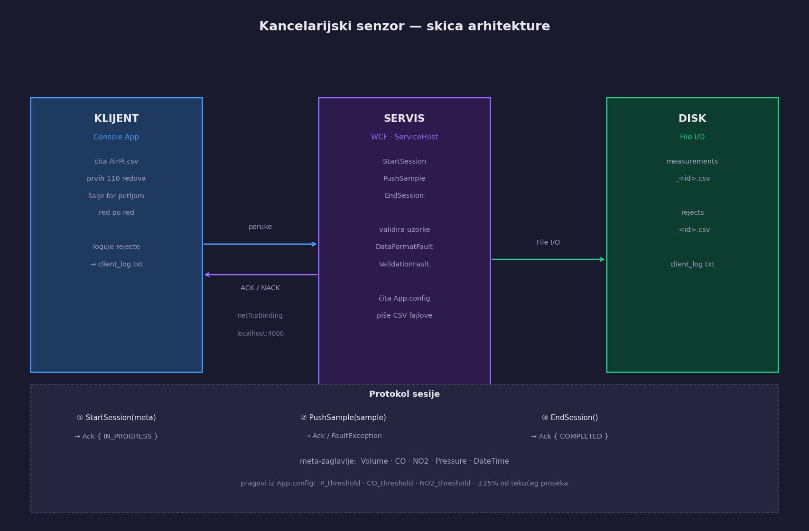

# Kancelarijski senzor

**Predmet:** Virtuelizacija procesa  
**Tim:** Danilo Ferjuc (PR 73/2023), Mladen Topuzovic (PR 133/2023)  
**Tema 20** — [Home Office AirPi dataset](https://www.kaggle.com/datasets/mvolkerts/home-office-airpi)

---

## Arhitektura

Tri projekta u jednom solution-u: `Common` (deljeni interfejs i klase), `Service` (WCF servis), `Client` (čita CSV i šalje uzorke).



Komunikacija: `net.tcp://localhost:4000/SensorService` putem `netTcpBinding`.

---

## Protokol

Svaka sesija prolazi kroz tri faze:

| Poruka | Argument | Odgovor |
|--------|----------|---------|
| `StartSession` | `SessionMeta` { Volume, CO, NO2, Pressure, DateTime } | `Ack { IN_PROGRESS }` |
| `PushSample` | `SensorSample` | `Ack { IN_PROGRESS }` ili `FaultException` |
| `EndSession` | — | `Ack { COMPLETED }` |

Klijent prolazi `for` petljom kroz prvih 110 redova CSV-a i šalje uzorke red po red — sledeći se ne šalje dok prethodni nije potvrđen.

---

## Validacija

| Provera | Greška |
|---------|--------|
| Polja nisu `NaN` / `Infinity` | `DataFormatFault` |
| `DateTime` nije default | `ValidationFault` |
| `Pressure > 0`, `CO/NO2/Volume >= 0` | `ValidationFault` |

Odbijeni uzorci idu u `rejects_<id>.csv`, sesija se ne prekida.

---

## Konfiguracija

`Service/App.config` — pragovi za detekciju anomalija i putanja za izlazne fajlove:

```xml
<appSettings>
  <add key="P_threshold"      value="0.5"  />
  <add key="CO_threshold"     value="5000" />
  <add key="NO2_threshold"    value="500"  />
  <add key="DeviationPercent" value="25"   />
  <add key="DataPath"         value="Data" />
</appSettings>
```

`Client/App.config` — putanja do CSV-a, broj redova, log fajl:

```xml
<appSettings>
  <add key="DatasetPath" value="Data\AirPi.csv"      />
  <add key="RowLimit"    value="110"                 />
  <add key="LogPath"     value="Data\client_log.txt" />
</appSettings>
```

---

## Pokretanje

1. Otvoriti `KancelarijskiSenzor.sln` u Visual Studio (.NET Framework 4.7.2)
2. Build solution — `Ctrl+Shift+B`
3. Right-click na `Service` → Set as Startup Project → `F5`
4. Sačekati poruku "Servis je otvoren"
5. Right-click na `Client` → Debug → Start New Instance

Posle pokretanja se kreiraju:

- `Service/bin/Debug/Data/measurements_<id>.csv` — validni uzorci
- `Service/bin/Debug/Data/rejects_<id>.csv` — odbijeni uzorci sa razlogom
- `Client/bin/Debug/Data/client_log.txt` — log ucitavanja CSV-a

